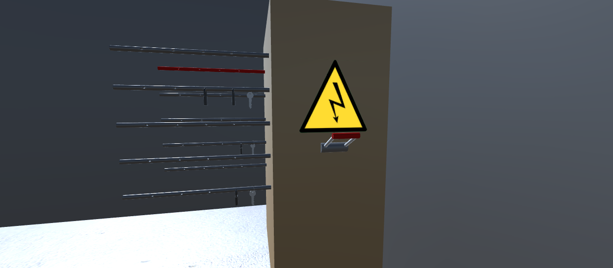
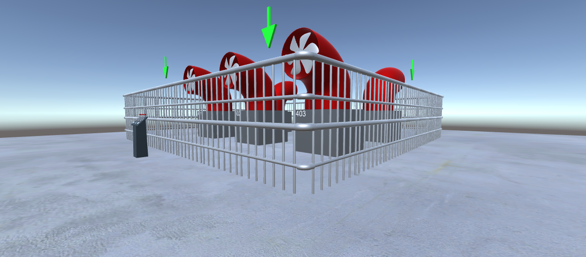
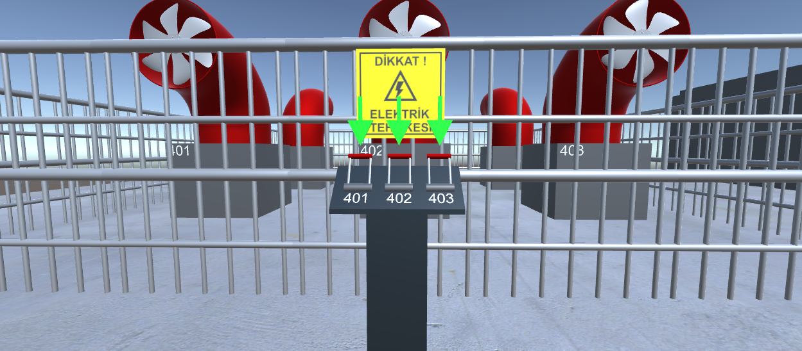
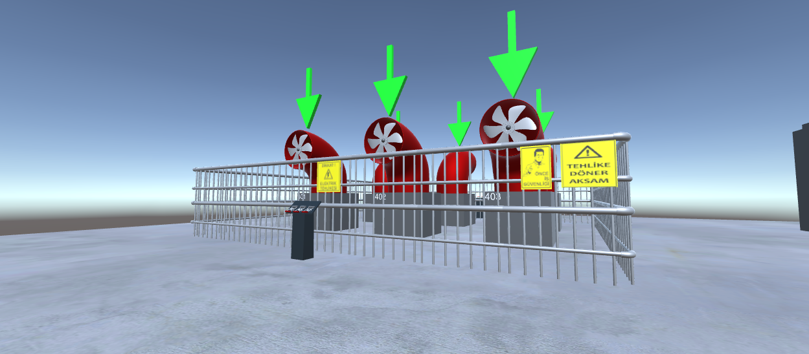
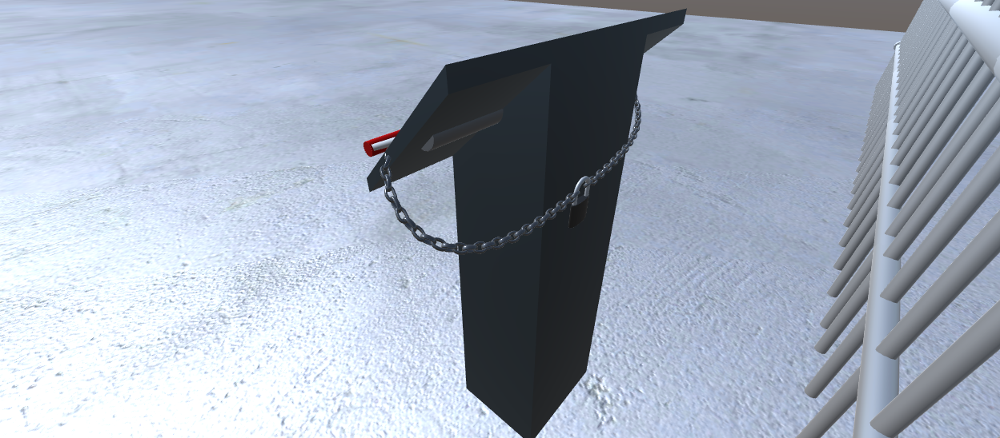
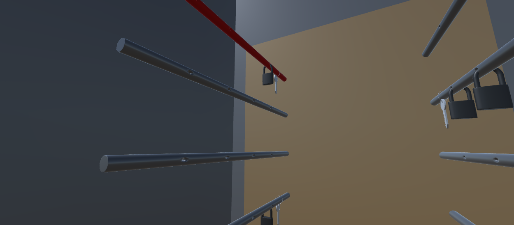

# ISGLevel3
Level 3 of the simulation that created on internship at PETKİM. Created with Unity, assets designed with Blender.
Prepared for the presentation, required keys to proceed are "E", "Z", "X", "C" and "V".
 
 

